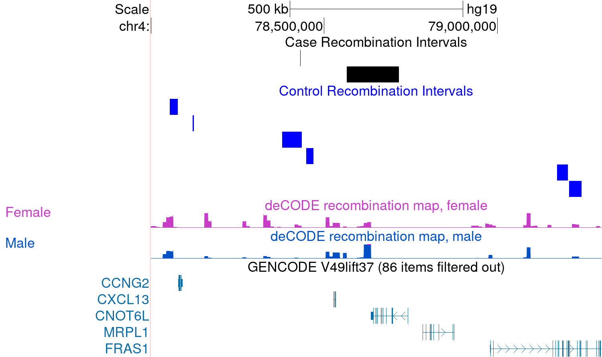

```{r, include = FALSE}
knitr::opts_chunk$set(
    collapse = TRUE,
    comment = "#>", 
    message=FALSE, 
    warning=FALSE
)
```

# Introduction

This package provides tools for analyzing meiotic recombination, runs of 
homozygosity, and long-distance haplotype phase in family-based genetic data.

## Installation
```{r, eval=FALSE}
if (!requireNamespace("BiocManager", quietly = TRUE)) {
    install.packages("BiocManager")
}

BiocManager::install("inferRecom")
```

```{r setup, echo=FALSE}
library(inferRecom)
library(S4Vectors)
library(GenomicRanges)
library(IRanges)
library(snpStats)
library(utils)
library(dplyr)
library(BiocParallel)
library(SummarizedExperiment)
library(rtracklayer)
library(trackViewer)
```

# Detecting recombination

`inferRecom` enables rapid, accurate detection of meiotic recombination in 
nuclear families. The following vignette detects recombination in a simulated 
set of pedigrees of varying sizes based on the CEU cohort from the 1000 Genomes 
Project using the package `sim1000G` and formatted in *PLINK* binary format. The
sex-specific recombination rate maps in Europeans used in this example were 
generated by Bhérer, et al., and are available via [Github](https://github.com/cbherer/Bherer_etal_SexualDimorphismRecombination). 

This vignette also showcases several auxiliary functions that facilitate 
visualization, analysis of regions of homozygosity, and chromosome-scale phasing
of informative markers.

## Detecting putative recombination intervals

The first section demonstrates the core function *xoDetect()*, which localizes 
and individualizes recombination in families with both parents and three or more
children, and localizes recombination in families with both parents and exactly 
two children. It filters artifacts arising from genotyping error and other 
experimental error using the default SNP-based criterion of five consecutive 
informative SNPs to confirm a recombination event, as well as a map-based 
criterion of one centiMorgan to confirm a recombination event.

```{r}
# Detect recombinations in families with two parents and three or more children
#    and families with two parents and exactly two children
# Filter for recombination with SNP-based and cM-based filters at default values
# Option to select for only SNPs that have an rs number is disabled by default

exampleDir <- system.file("extdata", package = "inferRecom")
simCEU <- file.path(exampleDir, "simCEU")
mapFemale <- file.path(exampleDir, "female_chr4.txt")
mapMale <- file.path(exampleDir, "male_chr4.txt")

pat3 <- xoDetect(simCEU, mapMale, familySize = 3, parent = "father", caseControl = FALSE)
mat3 <- xoDetect(simCEU, mapFemale, familySize = 3, parent = "mother", caseControl = FALSE)
pat2 <- xoDetect(simCEU, mapMale, familySize = 2, parent = "father")
mat2 <- xoDetect(simCEU, mapFemale, familySize = 2, parent = "mother")

pat3
```
The output of the functions is a GRanges object or list showing the 
individual/family IDs, SNP IDs, locations, and recombination rate map 
centiMorgan distances for each recombination. Given that families with two 
children do not have sufficient information to infer the recombinant child, the 
'CHILD' column is omitted in the output. If the caseControl option is specified, 
a list of GRanges separated by case/control status is returned. The results with
the default filtering parameters are shown below.

## Filtering for double recombination

Filtering for closely-spaced events can remove genotyping error and other 
artefacts in the data that are not consistent with true homologous 
recombination. The default value for the SNP filter is 5, and for the 
genetic-distance filter is 1cM. Setting the genetic distance-based filter to 0 
removes the genetic distance condition altogether. For comparison, the output 
below shows paternal recombinations in families with three or more children 
without the genetic distance filter.

```{r}
pat3_0cM <- xoDetect(simCEU,
    mapMale,
    familySize = 3,
    parent = "father",
    caseControl = FALSE,
    cmFilter = 0
)

pat3_0cM
```

Removing the genetic distance filter results in the detection of two 
recombination intervals in child 1 in pedigree 6 that are separated by only 
0.33cM (\~750kb), which is unlikely to represent a true meiotic recombination 
due to interference in crossing over.

## Visualizing `GenomicRanges` output from `xoDetect()` using `trackViewer` and `rtracklayer`

It is straightforward to visualize recombination intervals using the 
`Bioconductor` packages `trackViewer` and `rtracklayer`. Here, case and control 
intervals are plotted for basic comparison using `trackViewer`.

```{r}
mat3CC <- xoDetect(simCEU,
    mapFemale,
    familySize = 3,
    parent = "mother",
    caseControl = TRUE
)

# Add feature column for compatibility with "gene" type in trackViewer
mat3CC$case$feature <- "interval"
mat3CC$control$feature <- "interval"

caseTrack <- new(
    "track",
    dat = mat3CC$case,
    type = "gene",
    format = "BED"
)

setTrackStyleParam(caseTrack, "color", "black")

controlTrack <- new(
    "track",
    dat = mat3CC$case,
    type = "gene",
    format = "BED"
)

setTrackStyleParam(controlTrack, "color", "blue")

tl <- trackList(caseTrack, controlTrack) #
viewRegion <- GRanges("chr4", IRanges(78000000, 79500000))
viewTracks(tl, gr = viewRegion, autoOptimizeStyle = TRUE)
```

While `trackViewer` provides convenient functionality for visualization entirely
in an R environment, some intervals are not visible at this resolution. This 
and many other applications benefit from more interactive visualization directly 
in the UCSC Genome Browser. Example tracks as exported in the code below are 
shown in the browser alongside recombination maps and nearby genes.

```{r}
#| eval: false
export(mat3CC$case, "~/path/to/caseOutput.bed", format = "BED")

export(mat3CC$control, "~/path/to/controlOutput.bed", format = "BED")
```

```{r}
#|echo: false

```

# Runs of homozygosity

One of the factors that affects the density of informative SNPs and therefore 
the resolution of recombination intervals is the degree of homozygosity in the 
sample. The function `hzRun()` is a tool to detect runs of homozygosity of a 
user-specified minimum length in Mb (default 1Mb). To account for variation in 
SNP density, it also includes a criterion for the minimum number of SNPs per 
run, with a default value of 5. Users can also provide a genetic map and specify
a minimum centiMorgan length for runs. This example applies a sex-averaged map 
to all samples.

As the output is a GenomicRanges object or list, as in `xoDetect()`, the 
procedure to produce genome browser visualizations is identical to that of the 
recombination visualizations corresponding to `xoDetect()`.

```{r}
sexavg_chr4 <- file.path(exampleDir, "sexavg_chr4.txt")
hzRun(simCEU, sexavg_chr4)
```

# Phasing at Informative SNPs

Inferring recombination implies identity by descent in between the informative 
SNPs, allowing for the phasing of this subset of SNPs in the pedigrees with 
three or more offspring. Many population-based phasing programs are highly 
accurate over short distances, but phase accuracy deteriorates rapidly at 
distances greater than a few centiMorgans. The function `xoPhase()` implements a 
novel phasing algorithm to produce long-range haplotype phase information at 
informative SNPs. Using the information in the nuclear family structures, it is 
possible to obtain chromosome-scale haplotypes at the informative subset of 
SNPs. In these data, 36% of total SNPs are informative. Homozygous SNPs are also
reported, and non-informative SNPs are shown as NA.

The function `xoPhase()` uses the sets of maternal and paternal recombinations 
to infer haplotype phase at all informative SNPs for all members of each the 
nuclear families with three or more children. There is also an option to specify
a subset of family IDs for phasing.

Several options are available for output, including a list of DataFrames, a 
SummarizedExperiment object, or VCF. The paternal and maternal chromosomes 
transmitted in each child are labeled with the suffix 'Pat' and 'Mat' 
respectively, while each chromosome in the parents is labeled with a 1 or 2.

```{r}
phased <- xoPhase(simCEU,
    pat3,
    mat3,
    output = "list"
)
phased$F6[1158:1162, ]
```

# Session Information
The session information records the versions of all packages used in this
vignette.
```{r sessionInfo, eval=FALSE}
sessionInfo()
```


